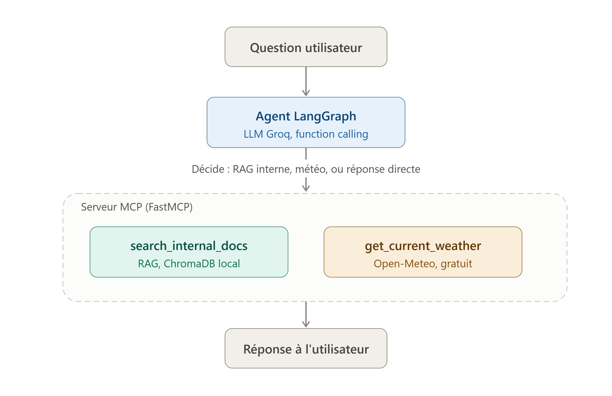

# Agent de veille documentaire — RAG + Function Calling + MCP

Agent conversationnel construit avec **LangGraph** (pattern ReAct), combinant
recherche documentaire interne (**RAG**) et appel d'API externe (**function
calling**), exposé via un serveur **MCP** (Model Context Protocol).

## Architecture

L'agent reçoit une question, décide (via le LLM) s'il doit consulter sa base
de connaissances interne, appeler une API météo externe, ou répondre
directement — puis boucle jusqu'à obtenir une réponse complète (pattern ReAct).

## Stack technique

| Composant | Techno | Pourquoi |
|---|---|---|
| Orchestration agent | LangGraph (`StateGraph` manuel) | Contrôle total du flow ReAct, pas de boîte noire |
| LLM (function calling) | Groq (`openai/gpt-oss-120b`) | Gratuit, function calling fiable sur gros modèles |
| RAG | ChromaDB + sentence-transformers | 100% local, aucune clé API |
| API externe | Open-Meteo | Aucune clé requise |
| Exposition | MCP (SDK officiel Anthropic, `FastMCP`) | Standard ouvert de composition d'outils LLM |
| Guardrails | Pydantic v2 | Validation d'inputs + fallback sur erreurs de tools |
| Observabilité | Logging structuré JSON | Traçabilité des décisions de l'agent, sans dépendance cloud |
| CI/CD | GitHub Actions | Lint (ruff) + tests (pytest) à chaque push |

## Installation

\`\`\`bash
git clone https://github.com/FatmaBouzid/agent-veille-mcp.git
cd agent-veille-mcp
uv sync
\`\`\`

Crée un fichier `.env` à la racine avec ta clé Groq (gratuite, sans CB, sur [console.groq.com](https://console.groq.com)) :

`

## Utilisation

**Indexer des documents dans le RAG :**
\`\`\`bash
uv run python -m agent_veille.rag.ingest
\`\`\`

**Lancer l'agent en CLI interactive :**
\`\`\`bash
uv run python scripts/run_agent.py
\`\`\`

**Lancer le serveur MCP :**
\`\`\`bash
uv run python src/agent_veille/mcp_server/server.py
\`\`\`

**Inspecter le serveur MCP visuellement :**
\`\`\`bash
uv run mcp dev src/agent_veille/mcp_server/server.py
\`\`\`

## Tests

\`\`\`bash
uv run pytest
uv run ruff check src tests
\`\`\`

## Choix d'architecture notables

- **Graphe LangGraph construit manuellement** (pas `create_react_agent`) pour
  garder un contrôle total et une compréhension complète de chaque nœud.
- **Tools exposés individuellement via MCP** plutôt que l'agent complet, pour
  rester composables par n'importe quel client MCP.
- **SDK MCP pinné en v1** (`mcp<2`) pour la stabilité — le SDK a une v2 qui
  renomme `FastMCP` en `MCPServer`, migration documentée mais volontairement
  différée pour ce projet.
- **Guardrails Pydantic** partagés entre l'agent LangGraph et le serveur MCP :
  un seul point de validation, comportement garanti identique des deux côtés.